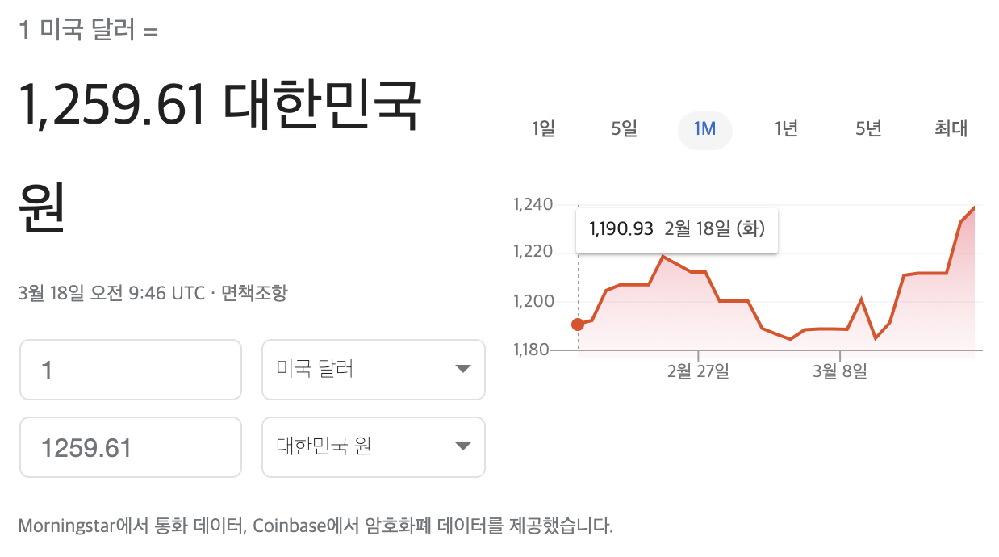

## 3월 18일 오늘의 경제 뉴스

[은행 선물환 포지션 한도 확대 기사](https://search.naver.com/search.naver?where=nexearch&sm=tab_htk.nws&ie=utf8&query=%EC%9D%80%ED%96%89+%EC%84%A0%EB%AC%BC%ED%99%98%ED%8F%AC%EC%A7%80%EC%85%98%ED%95%9C%EB%8F%84+25%25+%ED%99%95%EB%8C%80) 
오늘 오전에 실검에 계속 떠있던 기사에 대해 궁금한 것이 있어 가져와봤다.

## 기사 자세한 내용

국내 은행의 선물환 포지션 한도는 현행 40%에서 50%로 확대됩니다. 또 외국계 은행의 국내지점의 경우 200%에서 250%로 늘어납니다.

---

## 모르는 내용

### 선물이란?
파생상품의 한 종류로 간단하게 말하면 선 매매, 후 물건 인수 방식을 말한다. 
상품이나 금융자산을 미리 결정된 가격으로 미래의 어느 시점에 거래하겠다는 것을 뜻한다.

#### 예시
미래에 왠지 고구마가 가격이 오를 것 같은 생각이 든다. 
이 떄 고구마 농사 짓는 분이랑 1년 뒤 고구마 가격이 어떤지 보지않고 무조건 1개당 1,000원 으로 거래하자고 한다. 
농사 짓는 분도 나와 같이 가격이 오를 것 같으면 계약을 안할 것이고, 가격이 떨어질 것 같으면 계약을 한다.

> 이런식으로 계약은 지금하지만, 이행은 미래에 하는 것을 **선물**이라고 한다.

### 선물환이란?
고구마선물 = 고구마를 미래의 어느 날에 거래할 것인지 미리 해두는 계약
선물환 = 미래에 외국 돈을 얼마에 사고 팔기로 한 계약

### 선물환 포지션이란?
선물환 포지션 = 선물 외화 자산 - 선물 외화 부채

즉, 선물환 포지션은 은행의 자기 자본에 대한 **선물 외화 순자산 비율**을 의미한다.  
이 비율이 커지면 은행들이 외화 보유 규모를 늘릴 수 있게 되고 자본시장에 공급할 수 있는 외화도 그만큼 확대됩니다.

### 선물환 포지션 한도란?
선물환 포지션을 거래 하도 최대치를 정해놓은 값이다. 
이 비율이 늘어나게 되면 은행들이 외화 차입거래를 할 수 있는 한도가 늘어나 국내 외환시장에 외화 공급이 늘어나는효과를 보인다.

보통 환율이 급격하게 하락할 때 선물환계약 규제에 대한 얘기가 많이 들린다.
선물환 한도를 많이 줄이면, 선물환 계약을 하기에 신중해진다.
수출업체와 선물환 계약이 줄어들고 그만큼 은행이 외환시장에서 파는 달러가 줄어들게 된다.
은행이 파는 달러가 줄어들게 되면 환율이 급격하게 하락하는 것을 막을 수 있다.

반대로 환율이 급격하게 상승하면 선물환 한도를 늘리게 된다.
수출업체와 선물환 계약을 늘리고 은행이 외환시장에 많이 팔아서 환율이 급격하게 상승하는 것을 막을 수 있다.

---
## 기사의 의미

위의 사진처럼 현재 원/달러 환율이 2010년 6월 11일(1246.1원) 이후로 가장 높다.  
약 10년만에 환율이 최고 수준으로 높아졌다. 
이러한 환율에 정부가 외화 유동성 공급 확대 방안으로 선물환 포지션 한도를 상향한 것으로 보인다. 

## 참고 사이트
[경제뉴스 읽는 법](https://ecodemy.cafe24.com/felimi.html)