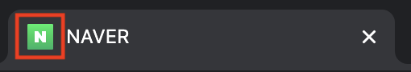

# Favicon이란?
**Favorites + Icon** 의 합성어로 웹 브라우저 주소창에 있는 아이콘을 뜻한다.

### 예시 - 네이버


<br/>
<br/>

## 홈페이지에 favicon 설정하기
### 이미지 준비
정사각형의 이미지를 준비한다.
보통 16 x 16을 많이 사용하지만, 나는 그냥 정사각형의 이미지를 사용했다.

<br/>

### ico 변환 사이트 이용
[ico 무료 변환 사이트](http://www.xiconeditor.com/)를 접속한 다음
import -> 이미지 open -> 16x16 선택 -> export
**favicon.ico**라는 이름으로 다운을 받는다.

 여기서 잠깐!

| 크기 | 용도 |
|:----------:|:----------:|
| 16x16 | IE9 주소 표시줄, 고정된(pinned) 사이트의 점프목록/툴바/오버레이 |
| 32x32 | IE의 새로운 탭 페이지, 윈도우7 이상에서 작업 표시줄 단추, Safari 나중에 읽기 사이드바 |
| 48x48 | 윈도우즈 사이트 아이콘 |

<br/>

### html 문서에 코드 삽입
```html
<link rel="shortcut icon" href="./favicon.ico" >
```

---
### 참고
더 자세한 favicon에 관한 내용은 아래 사이트를 참고하기.<br/>
[파비콘(Favicon)의 모든것](https://webdir.tistory.com/337)